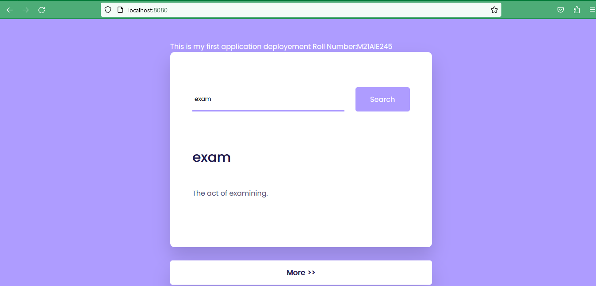

 ## CSL7510 Assessment-1 Docker Application Deployment.

 ## Authors 
 Rajesh Kumar
 - [M21AIE245](https://github.com/kumar-332)
    
 ### Steps Followed for the Creation of Custom Image for Web Application.
     - Created a web application using [HTML](./html/index.html), [CSS](./html/static/style.css), [JavaScript](./html/static/script.js). 
     - Selected Ubuntu Base Images for our application.
     - Update base Image and install NGINX server.
     - Copied all the configuration file to the required location.
     - Copied the Web application to the NGINX Default location.
     - Expose the `Port:80` for application and started the NGINX server.
     - After Followed the above steps, Image is  created.

 ### Steps Followed for the Application Execution.
     - For execution of the application, we are using Docker Compose.
         - [docker-compose.yml](./docker-compose.yml) is created for the same. It is using the previously created the [ockerfile](./Dockerfile) for the  container spin-up.
     - Mapping the container's `port:80`` to the local `port:8080`.
     - Execute the command to run the web application. 
        `docker compose up -d`
     - Now, application can be accessible on URL http://localhost:8080

### Please find the below screenshot image for application.
Application HomePage shown below:

